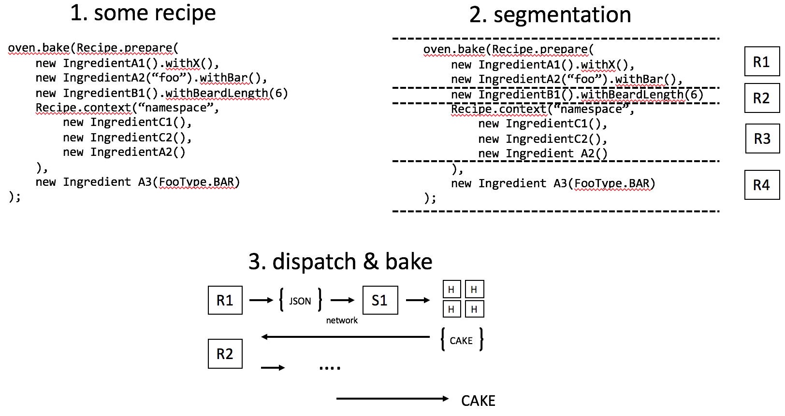

# Recipe

Recipe is a framework that makes it easy to set up data fixtures dynamically prior to running integration tests. Recipe generates ingredients based on your application's domain, which you combine into recipes that describe what data to prepare.

e.g., set up preconditions for an e-commerce test in  Java
```java
Recipe myRecipe = Recipe.prepare(
    new Customer("Jim"),
    new Product("Cat Slippers", "#01234", 14.99)
        .withAvailability(Region.CANADA, Region.TAIWAN),
    new PurchaseOrder("Jim", "Cat Slippers", 2)
        .withExpressShipping(true)
);

Cake cake = oven.bake(myRecipe);

/* run test logic */
String customerId = cake.get("Jim");
...
 ```
Recipes can be re-used, combined, or added to for fine-grained data setup. You can bake recipes with ingredients belonging to different services, so it is compatible with distributed architectures. Ingredients can be generated in any of the [supported languages](#lang-support) and behave the same because they invoke a single implementation hook, giving you a consistent, cross-language interface for setting up data.

Overall, recipe makes it easier to read, write, and maintain your tests. It is an alternative to pre-loading snapshots or making API calls to set up data (see [static vs dynamic](#static-vs-dynamic) data setup).

<a name="lang-support"/>

## Language support

|             | Java | TypeScript | JavaScript | Python |
|-------------|------|------------|------------|--------|
| Ingredients | ✓    | ✓          | ✓          | TODO   |
| Hooks       | ✓    | ✓          | ✓          | TODO   |

I will add new languages in response to demand. Please create an issue if you need support for another language.


##### Table of Contents
1. [Getting started](#getting-started)<br>
   1. [Concepts](#concepts)<br>
   1. [Your first cookbook](#first-cookbook)<br>
   1. [Writing hooks](#hooks)<br>
   1. [Re-using recipes](#recipe-composition)
   1. [Configuring the oven](#configure-oven)<br>
   1. [Understanding the cake](#the-cake)<br>
   1. [Contextful recipes](#contextful-recipes)<br>
1. [Usage](#usage)<br>
   1. [Generating ingredients and hooks](#generator)<br>
   1. [Run-time library](#runtime)<br>
1. [Cookbook spec](#cookbook-spec)<br>
1. [Miscellaneous topics](#miscellaneous-topics)<br>
    1. [Static vs. Dynamic Setup](#static-vs-dynamic)<br>
    1. [Setup for within-service ITs](#setup-for-within-service-its)<br>
    1. [Dealing with singleton data](#dealing-with-singleton-data)<br>
    1. [Recipe segmentation](#segmentation)<br>

<a name="getting-started"/>

## Getting started

Recipe applies the metaphor of baking cakes to setting up data fixtures. Let's go over the main concepts using Java examples (other supported languages will have the same or similar interfaces).

<a name="concepts"/>

### Concepts

A **recipe** is an all-in-one declaration of a test's data preconditions. It describes what state you want to exist across all of your service datastores before your test runs. Baking a recipe will instantiate a fresh copy of all of the described data at run-time. Here's what a typical recipe test looks like:
```java
/* 1. declare a recipe */
Recipe recipe = Recipe.prepare(
    new IngredientA()
        .withFoo("abc")
        .withBar(7),
    new IngredientB(true),
    new IngredientC()
);

/* 2. persist the data  */
Cake cake = oven.bake(recipe);

/* 3. run your test logic */
```

Recipes are made up of **ingredients**—builder-style objects that describe the corresponding entities in your domain (see [domain-driven design](https://en.wikipedia.org/wiki/Domain-driven_design))—or other recipes. Ingredients are generated from a **cookbook**—a yaml description of the entities—in your [language of choice](#lang-support). While ingredients may be owned by different services, they can all be baked together in a single recipe.

Recipes are composable and extendable. You can create a library of recipes that encapsulate common scenarios and share them between tests to avoid duplicated code and effort.

```java
Recipe recipe = Recipe.prepare(
    new CommonScenarioRecipe(), // a shared recipe with other ingredients
    new IngredientA(),
    new IngredientB(),
    ...
)
```

You bake recipes in an **oven**. The oven dispatches each ingredient to it's owning service which persists the ingredient by invoking its corresponding implementation **hook**. Like ingredients, hooks are generated, but only partially: you must subclass them to actually carry out the persistence logic. Baking a recipe creates a *new* copy of all of the described data; baking the same recipe twice would set up two sets of data.

The result of baking is a **cake**—a sophisticated key-value dictionary that gets passed between ingredients during baking and gives the test writer access to information about what was persisted. The cake is a little complicated; don't worry about it quite yet..

The power of Recipe is that it *decouples test fixture declaration from language and artchitecture*. This means that your recipes for your backend integration tests in Java will look and behave the same as the recipes for your end-to-end protractor tests written in TypeScript, giving your team a consistent and simple "language" to describe test setup.

<a name="first-cookbook"/>

### Your first cookbook

A *cookbook.yaml* file describes your ingredients. Think of an ingredient as a loose representation of one of your domain entities whose purpose is to collect just enough information to set up the entitiy.

Let's say we're making a MOBA and we have an entity called a Hero. All heroes have a *name*, *level*, and *intelligence*. They may also have a set of *abilities* in their repertoire along with a weapon. A hero without a level can be assumed to be at level 1. We can describe the Hero ingredient in a cookbook as follows:

```yaml
//cookbook.yaml

ingredients:
  - name: Hero
    required:
      - name: name
        type: string
      - name: intelligence
        type: float
      - name: level
        type: int
        default: 1
    initializers:
      - params: ["name", "intelligence"]
      - params: ["name", "intelligence", "level"]
    optionals:
      - name: abilities
        type: Ability...
      - name: weapon
        params:
          - name: name
            type: string
          - name: damage
            type: int
          - name: ranged
            type: boolean
        
enums:
  - name: Ability
    values:
      - FIREBALL
      - FORCE_PUSH
      - STUN    
```

If we run the above cookbook through a java [generator](#recipe-generator), you would get the following ingredient: 
```java
new Hero("Jim", 20.0f)
    .withAbilities(Ability.FIREBALL, Ability.STUN)
    .withWeapon("Bow", 40, true)
    
new Hero("Luke", 86.4f, 5)  // constructor with level
    .withAbilities(Ability.FORCE_PUSH)
```

Required properties are instantiated in the constructors (initializers), but can be left out if they have a default value (e.g., `level`). Optional parameters correspond to `withX` builder methods and can take a single typed value or be comprised of several properties (e.g., the optional `weapon` has a name, damage, and ranged flag). Recipe supports a variety of property types; see the [cookbook spec](#cookbook-spec) for more details. 

Ingredients are simple builder objects that just record what you do with them. They are generated in the project and language of the test suite, which may be different from the project that owns the data, so they contain no instantiation logic. To actually create the domain entity, you need to write implementation hooks, which take information from the ingredients to instantiate your domain objects. 

In general, you should have one cookbook per service.

<a name="hooks"/>

### Writing hooks

Hooks take the information supplied by ingredients and instantiate the underlying domain object(s) that they represent. Hooks should live in one place. While an ingredient can be generated in different test projects in different languages, all usages of the ingredient should invoke the same hook. You generate base hooks using the [generator](#recipe-generator) and extend them to provide an implementation.

Let's look at an example of a hook using our Hero ingredient from above:

```java
@Component
public HeroHook extends AbstractHeroHook {  /* AbstractHeroHook is generated */
    @Autowired
    private HeroService heroService;
    
    @Override
    public void bake(HeroData data, Cake cake) {
        // use the existing HeroService to instantiate the hero
        String heroId = heroService.createHero(data.getName(), data.getIntelligence());
        
        if (data.getLevel() > 1) {
            heroService.levelUp(heroId, data.getLevel())
        }
        
        if (data.hasAbilities() {
            for (Ability ability: data.getAbilities()) {
                heroService.addAbility(heroId, ability.name());
            }
        }
        
        if (data.hasWeapon()) {
            HeroData.WeaponParams weapon = data.getWeapon();
            heroService.addWeapon(weapon.name, weapon.damage, weapon.ranged);
        }
        
        // publish the id to the cake so we can access it from the test (more on this later..)
        cake.publish(data.getName(), heroId));
    }
}
```

`HeroData` is a generated snapshot of the information supplied by the ingredient. Required parameters like `name` have getters on the snapshot and are guaranteed to have a value. Optional parameters have a `hasX/isX()` along with getters and setters since they may not have been specified in the ingredient.

The extended class must override the `bake` method, which in this case simply invokes the existing hero service to perform validation and persist the hero to the database.

#### Where should hooks live?

Now that we know how to write a hook, where should we put it? This really depends on how you wish to integrate recipe into your system.

Hooks could be classes that live within your service and have direct access to service/controller needed to set up data (as in the above example). This requires creating a special recipe endpoint within your service to receive recipe payloads that are dispatched by the oven (discussed in detail later). If you take this approach, you should disable the recipe endpoint in production. I recommend setting up the data such that it goes through service validation, whether this means instantiating it from a service or controller class or some higher layer. This approach is ideal when there is some data (for example, initial database state) that cannot be set up via an exposed API.

If your service exposes an API that is capable of setting up all of the required data, you could move all hooks into a separate project. The hooks could just make API calls to your service to set up the appropriate data.

<a name="configure-oven"/>

### Configuring the oven

Ovens are the persistence engines that bake recipes and deliver ingredients to hooks across services for persistence. There are two types of ovens: an `Oven`, which exists in the same project as your tests, and a `BackendOven` which exists in the same project as your hooks.

#### Oven

An Oven is what you call to bake a recipe in your tests. Internally, the baking process produces json payloads that must be delivered to the services that own ingredients. Recipe makes no assumptions about which delivery mechanisms you use, so you must configure **dispatchers** for each domain to perform the delivery.
 
```java
Oven oven = new Oven(); // our oven instance

oven.addDispatcher("DomainA", payload -> {
    /* TODO: your code that sends payload to Service A over REST */
    ...
    return jsonResponse;
});

oven.addDispatcher("DomainB", payload -> {
    /* TODO: your code that sends payload to Service B over SOAP */
    ...
    return jsonResponse;
});
...
```

A dispatcher accepts a json payload, delivers it, and returns the response payload back to the oven.

#### Backend oven

A backend oven is at the receiving end of the payloads produced by the oven above. As such, your project must provide some endpoint capable of receiving the json payload using your own transport mechanism.

Upon receiving a payload, the endpoint should pass the payload to the backend oven instance. The backend oven interprets the payload, invokes the appropriate hook(s), and returns a response payload that must then be returned to the calling test service. This response is the payload that gets returned in the previous section.

```java
public HttpResponse myRecipeEndpoint(String payload) {
    String jsonResult = backendOven.bake(payload);
    
    /* your code to send json payload back to test service */
    ...
}
```

A backend oven needs to be told about each hook implemented in the service.

```java
BackendOven backendOven = new BackendOven(); // our backend oven instance

backendOven.registerHook(new HeroHook());
backendOven.registerHook(new ArenaSetupHook());
backendOven.registerHook(new InventoryItemHook());
...

```

If you're using java Spring, a simpler alternative to registering each hook is to make your hook subclasses components and autowire them in.
```java
@Configuration
public class BackendOvenConfig {
    @Autowired
    private BaseIngredientHook[] hooks;

    @Bean
    public BackendOven getBackendOven() {
        BackendOven backendOven = new BackendOven();

        for (BaseIngredientHook hook: hooks) {
            backendOven.registerHook(hook);
        }

        return backendOven;
    }
}
```

For more information on the payloads and what information they contain, see [recipe segmentation](#segmentation).

<a name="recipe-composition"/>

### Re-using recipes

Groups of similar tests often have similar data setup. To avoid duplication, you can encapsulate common sets of ingredients into re-usable recipes or "fixtures".

One way to do this is to extend the Recipe class:
```java
class SimpleBattleFixture extends Recipe {
    public static final String JASON = "Json The Bearded";
    public static final String PEARL = "Pearl";

    public SimpleBattleFixture() {
        super(
            new Hero(JASON, 10.0f)
                .withAbilities(Ability.FIREBALL)
                .withWeapon("sword", 5, false),
            new Hero(PEARL, 15.4f)
                .withAbilities(Ability.FORCE_PUSH)
                .withWeapon("bow", 3, true),
            new ArenaSetup(Landscape.FOREST)
                .withMatchup(JASON, PEARL)
        );
    }
}
```

You can then use it as an ingredient in another recipe because recipes are ingredients (did the metaphor just break?).

```java
oven.bake(Recipe.prepare(
    new SimpleBattleFixture(),
    new InventoryItem(SimpleBattleFixture.JASON, "Healing Potion"),
    new AttackPowerUp(SimpleBattleFixture.PEARL, 10, "7s")
));
```

In addition to subclassing Recipe, you can pass in stored instances of recipes or parameterized recipes generated from a function.

In general, you should create fixtures when you find yourself repeating the same sets of ingredients for a group of tests. It's useful to have a library of fixtures that describe high-level scenarios, adding ingredients using composition for additional fine-grained setup. 

*Note the use of string key constants to refer to hero entities created in the `SimpleBattleFixture`. This is a useful way to refer to entities when other ingredients depend on them. This will be covered in more detail in the following section.*

<a name="the-cake"/>

### Understanding the cake

A cake is the result of baking a recipe. It is a sophisticated key-value dictionary that is useful for sharing information between ingredients (enabling dependencies), and returning information about what was persisted at bake-time to the test author for use in tests.

1. [Passing data to a test](#passing-data-to-a-test)<br>
1. [Passing data between ingredients](#passing-data-between-ingredients)<br>
1. [Fixture keys](#fixture-keys)<br>
1. [Keyed ingredients and default keys](#keyed-ingredients-and-default-keys)<br>
1. [Namespaces](#namespaces)<br>
1. [Cake key resolution](#cake-key-resolution)

#### Passing data to a test

Tests often require information about what was baked. For example, if we bake a `Hero` ingredient and a real hero gets persisted, then we may need that hero's database ID for use in an integration test.

```java
@Override
public void bake(HeroData data, Cake cake) {
    String heroId = heroService.createHero(data.getName(), data.getIntelligence());
    cake.publish(data.getName(), heroId));
}
```

In the above example, we publish the created hero's ID to the cake using the hero's name as the key. After baking, we can retrieve hero IDs from the cake:

```java
Cake cake = oven.bake(Recipe.prepare(
    new Hero("Jim", 20.0f)
    new Hero("Luke", 86.4f, 5)
));

String hero1Id = cake.get("Jim");
String hero2Id = cake.get("Luke");

/* test logic */
heroService.updateAttack(hero1Id, 8);
...
```

When you call `oven.bake`, a single cake is created and passed around to each hook that gets invoked, and is finally returned to the test with all cake values that were added.

#### Passing data between ingredients

You can use the cake to facilitate setting up entities that depend on one another. For example, an InventoryItem belongs to a Hero and has a foreign key constraint, so it needs the hero's ID in order to be instantiated.

The way to deal with these relationships in Recipe is to pass the cake keys (strings) in place of depenent data that can only be resolved at bake time. The cookbook delcaration for an `InventoryItem` might look like:

```yaml
ingredients:
  - name: InventoryItem
    required:
      - name: hero
        type: string
      - name: itemName
        type: string
      - name: quantity
        type: int
        default: 1
    initializers:
      - params: ["hero", "itemName"]
      - params: ["hero", "itemName", "quantity"]
``` 

We would then bake the ingredient, passing the key for hero ID, "Jim" (which we know because we wrote the Hero hook to publish the ID under the hero's name).

```java
oven.bake(Recipe.prepare(
    new Hero("Jim", 20.0f),
    new InventoryItem("Jim", "CatSlippers")
));
```
The InventoryItem's hook would then resolve the hero ID using `cake.get`. We know that the ID is in the cake because ingredients are baked in order:

```java
@Override
public void bake(InventoryItemData data, Cake cake) {
    String heroId = cake.get(data.getHero());
    inventoryService.addItem(heroId, data.getItemName());
}
```

#### Fixture keys

When encapsulating ingredients in a fixture recipe, it's often helpful to expose any cake keys that are published when the fixture is baked.

```java
class SimpleBattleFixture extends Recipe {
    public static final String JASON = "Json The Bearded";
    public static final String PEARL = "Pearl";

    public SimpleBattleFixture() {
        super(
            new Hero(JASON, 10.0f)
                .withAbilities(Ability.FIREBALL)
                .withWeapon("sword", 5, false),
            new Hero(PEARL, 15.4f)
                .withAbilities(Ability.FORCE_PUSH)
                .withWeapon("bow", 3, true),
            new ArenaSetup(Landscape.FOREST)
                .withMatchup(JASON, PEARL)
        );
    }
}
```

This allows convenient access to the cake values, which may be used in a test or passed in to other ingredients without copying the string literal key.

```java
Cake cake = oven.bake(Recipe.prepare(
    new SimpleBattleFixture(),
    new Armor(SimpleBattleFixture.JASON, "Plate", 50)
));

String heroId = cake.get(SimpleBattleFixture.JASON);

/* test damage reduction on hero from presence of armor */
...
```

#### Keyed ingredients and default keys

When we have many ingredients publishing data to the cake we're inevitably going to run into a case where two ingredients try to publish data under the same key. This will cause an error because all keys must be unique.

For example, the Hero hook described above publishes the hero ID under the hero's name. But what if we have two hero's named Jim?
```java
oven.bake(Recipe.prepare(
    new Hero("Jim", 20.0f),
    new Hero("Jim", 86.4f, 5) // error!
));
```

One way to get around this issue is to manually specify the key we want to use when writing the recipe. We can do this by making Hero a keyed ingredient in the cookbook.

```yaml
ingredients:
  - name: Hero
    keyed: true
    ...
```

Keyed ingredients have a special new property called `key`. We could change the Hero hook to publish the ID under this new key property.

```java
@Override
public void bake(HeroData data, Cake cake) {
    String heroId = heroService.createHero(data.getName(), data.getIntelligence());
    ...
    
    if (data.hasKey()) {
        cake.publish(data.getKey(), heroId);
    }
}

```

Now we can create two heroes named Jim that publish their ID under different keys using the `keyed` operator that is only available to keyed ingredients.


```java
Cake cake = oven.bake(Recipe.prepare(
    new Hero("Jim", 20.0f).keyed("hero1"),
    new Hero("Jim", 86.4f, 5).keyed("hero2")
));

String hero1Id = cake.get("hero1");
String hero2Id = cake.get("hero2");
```

Great, we now have a way to deal with duplicate cake keys! But what if having two heros with the same name is rare, and we would still like to publish the ID under the hero's name by default, only falling back to using `keyed` when necessary to avoid conflicts? We can accomplish this by adding a `defaultKey` to the hero ingreident in the cookbook and updating the hook to check if the key was overridden:
 
```yaml
ingredients:
  - name: Hero
    keyed: true
    defaultKey: name
    required:
      - name: name
        type: string
    ...
```

```java
@Override
public void bake(HeroData data, Cake cake) {
    String heroId = heroService.createHero(data.getName(), data.getIntelligence());
    ...
    
    cake.publish(data.getKey(), heroId);  // key same as name unless overridden with keyed()
}

```

```java
Cake cake = oven.bake(Recipe.prepare(
    new Hero("Jim", 20.0f),                     // key = "Jim"
    new Hero("Jim", 86.4f, 5).keyed("someHero") // key = "someHero"
));
```

The `defaultKey` is set to a required string property (string so that it can be a cake key), and the key assumes the same value as the given required property.

In the examples we've seen so far, a hook has only published one value. But in reality, hooks can publish as many values as they want. If making an ingredient a keyed ingredient only gives us one unique key that we can override, how can we store more than just an ID without causing cake key conflicts? What if an ingredient sets up multiple database objects and we want to publish all of the IDs? We can do this by treating a keyed ingredient's key as a namespace that other values can be published under. 
 
#### Namespaces

The cake supports hierarchical namespacing of keys. Namespaces are particularly useful for storing several cake values under the key of a keyed ingredient.

For example, let's say that each time a Hero is created, service logic dictates he or she receives a random quantitiy of gold. For convenience, we may want to store the gold quantity in the cake along with the hero's ID so that it can be easily accessed by tests. In the HeroHook we could write:

```java
@Override
public void bake(HeroData data, Cake cake) {
    // creates the hero with a random amount of gold
    String heroId = heroService.createHero(data.getName(), data.getIntelligence());
    
    cake.publish(data.getKey(), heroId);
    cake.inNamespace(data.getKey(), () -> {
        cake.publish("gold", heroService.getGold(heroId));
    });
}
```  

As before, we publish the ID under the hero's key, but now we also treat the key as a namespace and store the `"gold"` key under that namespace. A test accessing these values would look like:

```java
Cake cake = oven.bake(Recipe.prepare(
    new Hero("Jim", 20.0f).keyed("myHero")
));

String heroId = cake.get("myHero");
int startingGold = cake.get(Cake.key("myHero", "gold"));
```

Notice the use of the helper method `Cake.key` for declaring a hierarchical key. Now we can have many hero ingredients that each publish their ID and starting gold amount without conflicting cake keys.

When using subkeys like `"gold"` in this fashion, it is good practice to provide a class-level constant for accessing it. The [cookbook](#cookbook-spec) provides support for generating ingredients and hooks with subkey constants:

```yaml
ingredients:
  - name: Hero
    constants:
      GOLD: "gold"
    required:
    ...
```

The constant is generated in the abstract hook superclass:

```java
@Override
public void bake(HeroData data, Cake cake) {
    // creates the hero with a random amount of gold
    String heroId = heroService.createHero(data.getName(), data.getIntelligence());
    
    cake.publish(data.getKey(), heroId);
    cake.inNamespace(data.getKey(), () -> {
        cake.publish(AbstractHeroHook.GOLD, heroService.getGold(heroId));
    });
}
```  

...and in the ingredient:

```java
Cake cake = oven.bake(Recipe.prepare(
    new Hero("Jim", 20.0f) // key defaults to "Jim"
));

String heroId = cake.get("Jim");
int startingGold = cake.get(Cake.key("myHero", Hero.GOLD));
```
 
#### Cake key resolution

When you call `cake.get` either in a hook or in a test, the following rules are used to resolve the value.

1. Search for the key within the current namespace
1. Search for the key in each parent namespace up to the root
1. If at the root namepace, search for the key within any namespace, as long as it is unambiguous

For example:

```java
cake.publish("a", 1);
cake.inNamespace("b", () -> {
    cake.publish("c", 2);
    cake.publish("d", 3);
});
cake.inNamespace("e", () -> {
    cake.publish("d", 5);
});

cake.get("a");                  // => 1
cake.get(Cake.key("b", "c"));   // => 2
cake.get("c");                  // => 2
cake.inNamespace("b", () => {
    cake.get("d");              // => 3
});
cake.get("d");                  // error! ambiguous
```

<a name="contextful-recipes"/>

### Contextful recipes

*Note: This is an advanced topic. Make sure you're comfortable with cakes, keyed ingredients, and namespaces before using contextful recipes.*

Contextful recipes are another (optional) type of recipe you can use to make recipes a bit less verbose and easier to read. Let's say that we have a Hero named Jim, and Jim is a bit of a hoarder so he always has plenty of items in his inventory.

```java
Recipe.prepare(
    new Hero("Jim", 86.4f, 5),
    new InventoryItem("Jim", "Healing Potion", 5),
    new InventoryItem("Jim", "Invisibility Branch"),
    new InventoryItem("Jim", "Lightning Boots"),
    new InventoryItem("Jim", "Utlimate Cat Slippers")
);
```

It can be a little tedious to pass `"Jim"` to each and every item (recall that InventoryItem has a foreign key constraint on a Hero ID). It would be cleaner if we could say "prepare all of the following inventory items assuming the owner is Jim" and not have to repeat the parameter. This is what contextful recipes do: they allow a keyed ingredient (in this case, the hero Jim) to assume the "context" of a recipe which all sub-ingredients can refer to using a special cake method.

```java
Recipe.prepare(
    new Hero("Jim", 86.4f, 5),
    Recipe.context("Jim",
        new InventoryItem("Healing Potion", 5),
        new InventoryItem("Invisibility Branch"),
        new InventoryItem("Lightning Boots"),
        new InventoryItem("Utlimate Cat Slippers")
    )
);
```

`Recipe.context` prepares a recipe in the context of an existing cake key (the **context key**), which has a published value (the **context**). We can fetch the context, in this case the hero ID, in `InventoryItemHook` by calling `cake.getContext`:

```java
@Override
public void bake(InventoryItemData data, Cake cake) {
    /* resolve the hero id from the current context */
    String heroId = cake.getContext();
    
    heroService.addItem(heroId, data.getItemName());
}
```

This assumes that `InventoryItem` is always prepared in the context of a `Hero` ingredient, which is fine, but what if we want the ingredient to work within or without a context? We can declare two initializers for InventoryItem, one intended to be used in a context, and the other, without one:

```yaml
ingredients:
  - name: InventoryItem
    required:
      - name: hero
        type: string
        default: null
      - name: itemName
        type: string
    initializers:
      - params: ["hero", "itemName"]
      - params: ["itemName"]  # within hero context
```

Our InventoryHook could then use the cake helper method `cake.getOrGetContext`, which gets the value for a key and falls back to fetching the value from the context if the key is null (note that the `hero` property will be null if the non-contextful initializer is called).

```java
@Override
public void bake(InventoryItemData data, Cake cake) {
    /* resolve the hero id from either the hero property or the current context */
    String heroId = cake.getOrGetContext(data.getHero());
    
    inventoryService.addItem(heroId, data.getItemName());
}
```

And now we can use the ingredient within or without a context:

```java
Recipe.prepare(
    new Hero("Jim", 86.4f, 5),
    Recipe.context("Jim",
        new InventoryItem("Healing Potion", 5),
        new InventoryItem("Invisibility Branch")
    )
    new InventoryItem("Jim", "Lightning Boots")
);
```

*Note that you can still call the non-contextful initializer of InventoryItem inside of a contextful recipe, and in that case it will resolve the hero ID from the hero parameter, not from the context.*

`Recipe.context` can also accept a keyed ingredient directly, which has the same effect as first declaring the ingredient then passing in it's key:

 ```java
Recipe.context(new Hero("Jim", 86.4f, 5),  // context key = "Jim"
    new InventoryItem("Healing Potion", 5),
    new InventoryItem("Invisibility Branch"),
    new InventoryItem("Lightning Boots"),
    new InventoryItem("Utlimate Cat Slippers")
);
```

Coincidentally, contextful recipes also wrap child ingredients in the namespace of the context key. This means that any ingredients within a contextful recipe that publish cake values will automatically have those values published in the namespace of the context key. This provides an alternative to using `keyed()` to prevent cake key conflicts:

```java
Recipe.prepare(
    Recipe.context("foo",
        new Hero("Jim", 86.4f, 5),              // keyed as "foo.Jim"
        new InventoryItem("Healing Potion", 5),
    ),
    Recipe.context("bar",                       // keyed as "bar.Jim"
        new Hero("Jim", 86.4f, 5),
        new InventoryItem("Invisibility Branch"),
    )
);

```

Contextful recipes help you reduce the number of arguments you need to provide to ingredients, and happens to work nicely with parent-child relationships between entities. However, it is not intended as a way model complex relationships between entities in your domain, and should be seen first and foremost as a way to reduce verbosity or as a namespacing mechanism to prevent cake key conflicts.

<a name="usage"/>

## Usage

<a name="generator"/>

### Recipe Generator
The recipe generator is an executable jar that generates ingredients and hooks in all [supported languages](#lang-support). For convenience, the generator can be invoked via the following build tools/plugins. If your particular build system is not supported, download and invoke the jar directly to perform the generation.

#### Arguments
`domain` - name of the domain represented by the cookbook

`flavour` - generation type; one of: `java-ingredient`, `java-hook`, `js-ingredient`, `js-hook`, `ts-ingredient`, `ts-hook`

`cookbook` - path to the cookbook; defaults to `cookbook.yaml` in the project directory

`targetDir` - output directory for generated files

`ingredientPostfix` (optional) - string postfix to add to each ingredient class name

##### Java-specific arguments

`javaPackage` - java package for generated classes


#### Maven plugin

##### Example: Generate ingredients

```xml
<plugin>
    <groupId>ca.derekcormier.recipe</groupId>
    <artifactId>recipe-generator-maven-plugin</artifactId>
    <version>0.3.5</version>
    <executions>
        <execution>
            <id>generate-ingredients</id>
            <phase>generate-test-sources</phase>
            <goals>
                <goal>generate</goal>
            </goals>
            <configuration>
                <domain>MyDomain</domain>
                <flavour>java-ingredient</flavour>
                <cookbook>${project.basedir}/cookbook.yaml</cookbook>
                <targetDir>${project.build.directory}/generated-test-sources/recipe</targetDir>
                <javaPackage>ingredient.package.name</javaPackage>
            </configuration>
        </execution>
    </executions>
</plugin>
```

##### Example: generate hooks

```xml
<plugin>
    <groupId>ca.derekcormier.recipe</groupId>
    <artifactId>recipe-generator-maven-plugin</artifactId>
    <version>0.3.5</version>
    <executions>
        <execution>
            <id>generate-hooks</id>
            <phase>generate-test-sources</phase>
            <goals>
                <goal>generate</goal>
            </goals>
            <configuration>
                <domain>MyDomain</domain>
                <flavour>java-hook</flavour>
                <cookbook>${project.basedir}/cookbook.yaml</cookbook>
                <targetDir>${project.build.directory}/generated-sources/recipe</targetDir>
                <javaPackage>hook.package.name</javaPackage>
            </configuration>
        </execution>
    </executions>
</plugin>
```

#### Node module
```json
"dependencies": {
  "recipe-generator-node": "0.3.5"
}
```

##### Example: generate ingredients
```json
"scripts": {
  "generate": "recipe-generator MyDomain ts-ingredient cookbook.yaml ./target/ingredients"
}
```

```bash
npm run generate
```

#### Invoke jar directly

[Download](https://search.maven.org/#search%7Cga%7C1%7Ca%3A%22recipe-generator%22) the latest jar-with-dependencies and run:

```java -jar recipe-generator-x.y.z-jar-with-dependencies.jar```

...to see the usage options.

<a name="runtime"/>

### Run-time library

The run-time libraries contain the core classes required by Recipe.

#### Java
```xml
<dependency>
    <groupId>ca.derekcormier.recipe</groupId>
    <artifactId>recipe-java-runtime</artifactId>
    <version>0.3.5</version>
</dependency>
```
#### JavaScript
```json
"dependencies": {
  "recipe-js-runtime": "0.3.5"
}
```
#### TypeScript
```json
"dependencies": {
  "recipe-ts-runtime": "0.3.5"
}
```

<a name="cookbook-spec"/>

## Cookbook spec

### Required parameters and initializers

Required parameters have a name, type, and an optional default value. Unlike optional params, required params always receive a value upon the creation of the ingredient.

```yaml
ingredients:
  - name: MyIngredient
    - required:
      - name: foo
        type: string
        default: "bar"
```

Every required param must either appear in every initializer or have a default value:
```yaml
    - required:
      - name: foo
        type: string
        default: "bar"
    - initializers:
      - params: []
      - params: ["foo"]
```

Generated:
```java
new MyIngredient()        // <- empty constructor, foo defaults to "bar"
new MyIngredient("baz")
```

### Optional parameters

Optional parameters result in `withX` methods on an ingredient. Optionals may or may not receive a value depending on how the ingredient was used. There are two types of optionals: *simple* and *compound*.

#### Simple optionals

Simple optionals take a single typed parameter in the `withX` method.

```yaml
ingredients:
  - name: MyIngredient
    - optionals:
      - name: foo
        type: boolean
```

Generated:
```java
new MyIngredient()
    .withFoo(true)
```

#### Compound optionals

Compound optionals are made up of several typed parameters.

```yaml
ingredients:
  - name: MyIngredient
    - optionals:
      - name: foo
        params:
          - name: bar
            type: int
          - name: baz
            type: string
```

Generated:
```java
new MyIngredient()
    .withFoo(10, "kittens")
```

#### Repeatability

Both simple and compound optionals can be `repeatable`, meaning that if the `withX` is called more than once, the values for each invocation will be stored and available to the hook.

```yaml
ingredients:
  - name: MyIngredient
    - optionals:
      - name: foo
        repeatable: true
        params:
          - name: bar
            type: string
          - name: baz
            type: int
```

Generated:
```java
new MyIngredient()
    .withFoo("a", 1)
    .withFoo("b", 2)
    .withFoo("c", 3)
```

The above is useful for storing map-like data.

### Types

Recipe supports a number of parameter types.

#### Primitives

* `string`
* `int`
* `float`
* `boolean`
* `flag`

##### Flag

The *flag* type is similar to a boolean, but rather than the optional method taking a boolean value, it gets set to true if the optional was invoked. For example, if we have a flag named `enabled`:

```java
new MyIngredient().withEnabled()
``` 

The value of the optional will be true in the hook, or false if `withEnabled()` was never called. Contrast this to boolean optional which actually has three potentional values: was called and is true, was called and is false, or was never called (perhaps it should be called a troolean?).

#### Arrays and varargs

The above primitive types can be turned into arrays by appending `[]` to the type.

```yaml
ingredients:
  - name: MyIngredient
    - optionals:
      - name: foo
        type: string[]
```

Generated:
```java
new MyIngredient()
    .withFoo(new String[]{"foo", "bar"})
```

You can also turn primitives or arrays of primitives into varargs by appending `...` to the type. If the property appears in the last parameter list of the generated initializer or optional method, it will behave as a vararg (assuming language support), otherwise it will just be an array. As far as the hook is concerned, the resulting value will be an array.

```yaml
ingredients:
  - name: MyIngredient
    - optionals:
      - name: foo
        type: boolean...
```

Generated:
```java
new MyIngredient()
    .withFoo(true, false, true, false)
```

#### Enums

You can declare enums in the cookbook to that can be used as parameter types.

```yaml
ingredients:
  - name: MyIngredient
    optionals:
      - name: foo
        type: MyEnum      
  
enums:
  - name: MyEnum
    values:
      - A
      - B
      - C
```

Generated:
```java
new MyIngredient()
    .withFoo(MyEnum.B)
```

#### Objects

I'm considering adding support for generated objects to be used as parameters, but I'll likely wait until there is demand. Given that ingredients are intended to collect just enough information to set up a domain entity, I'm convinced this can be done in 99% of cases using the combination of primitives, compound optionals, repeatability, and enums.

## Miscellaneous topics

<a name="static-vs-dynamic"/>

### Static vs. Dynamic Setup

Setting up data for integration tests is challenging.

Each integration test requires a carefully planned set of data to be prepared before running the test logic. In a distributed service architecture, this data may be persisted across several data stores. But how do you set up the data in the first place?

#### Snapshot approach

One approach is to maintain a set of database snapshots and load them up for each test or family of tests. Although this is usually faster than re-creating data at run-time, there are a few downsides:
* *Lack of precision*: snapshots require a lot of work to create. This encourages them to (sometimes innaproproately) be reused for several tests to save effort, despite containing more data than a particular test may need. The presence of extra data may introduce false positives.
* *Lack of clarity*: depending on the snapshot format (sql, xml, etc.), it can be difficult to determine at a glance exactly what data is being set up for a test, making the test harder to debug and modify.
* *Migration overhead*: databases and snapshots need to be migrated whenever the data schema changes. If the data format was text-based and laid out in a way to make it more readable, automatic migrations could muddle this organization.
* *Difficult to extend*: if two tests require similar but slightly different setups, it is tempting to duplicate the original snapshot and modify it slightly; not being able to break up and re-use common parts of snapshots leads to a lot of duplicated setup that is difficult to maintain.

#### Dynamic approach

Another approach is to set up data using a series of API calls, or, if testing within-service, calls to the controller, service, or data access layers of an application. This is slower but avoids migration issues since all setup is done at run-time and (ideally) undergoes  validation, preventing impossible data states. However, there are still issues:
* *Convoluted setup*: a long series of api/service calls at the beginning of each test is hard to read, and similar to the snapshot approach it can be difficult to see the full picture of what is being set up.
* *Language differences*: two services written in different languages may want to set up the same data on a common third service, but that setup may look different depending on how the services implement their interface to the third service.

What's missing is a simple way to *declare*, *combine*, and *maintain* data fixtures such that each test sets up only the data it actually needs and in a language agnostic way. As architectures become less monolithic and more distrubuted with different languages and stacks, it is important to be to able to easily configure fine-grained data states for cross-service testing.

This is where Recipe comes in.

### Setup for within-service ITs

If you're integration testing within a service, then configuring the oven's payload delivery is easy. When configuring a dispatcher for your Oven, simply deliver the payload directly to the BackendOven instance.

```java
Oven oven = new Oven();
BackendOven backendOven = new BackendOven();

oven.addDispatcher("DomainA", payload -> {
    return backendOven.bake(payload);
});
```

### Dealing with singleton data

Problem: A recipe setups up all of the data required for a test from a zero-state. Some of that data is *singleton*—there's a single, shared copy of the data that is assumed to exist, and you don't want to duplicate that data by running two tests with recipes back-to-back.

If you clear your data stores between tests, then this isn't really a problem. But you might choose not to clear your data for performance reasons and if you know that a new set of data generated by a recipe will be indepdent from the data in a previous test.

One solution is to put singleton logic in the hook of the ingredient responsible for setting up the singleton data:

```java


@Test
public void testFoo() {
    oven.bake(Recipe.prepare(
        new SingletonConfiguration(),  // singleton data gets set up
        ...
    ));
    ...
}

@Test
public void testBar() {
    oven.bake(Recipe.prepare(
        new SingletonConfiguration(), // not set up again
        ...
    ));
    ...    
}
```

```java
@Component
public SingletonConfigurationHook extends AbstractSingletonConfigurationHook {    
    @Autowired
    private ConfigurationService configService;
    
    @Override
    public void bake(SingletonConfigurationData data, Cake cake) {
        /* only persist configuration if it doesn't already exist */
        if (!configService.hasX()) {
            configService.setupX(data.getX());
        }
    }
}
```

In the case where you have a bunch of data that is assumed to always exist in a database, it's often useful to create a singleton "bootstrap" ingredient and hide it within some base fixture that all other fixtures extend.

### Recipe segmentation

Recipe delivers each ingredient to its owning service for baking. However, rather than delivering ingredients one-by-one (and incuring potential network delays), ingredients are delivered in batches called payloads.

When you bake a recipe (1), it first gets segmented into groups of contiguous same-service ingredients (2). Each of these groups (payloads) are serialized into json and dispatched to the owning service along with the current cake (3). After arriving at the service, the corresponding hooks are invoked for each ingredient and the updated cake is sent back. This process repeats for each group of ingredients until the final cake is returned to the test.

<br>




---

*Thanks to [Elle Chau](https://www.instagram.com/artof_elle/?fbclid=IwAR2LxIdYmwUo8TDvbOTzt80yD9MSYTrY1ToC2T22QIEnK9c9STr-z_LbdC4) for the logo.*


